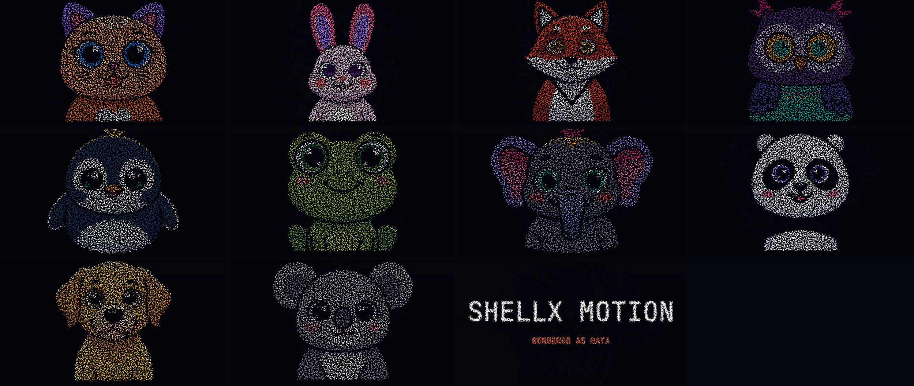
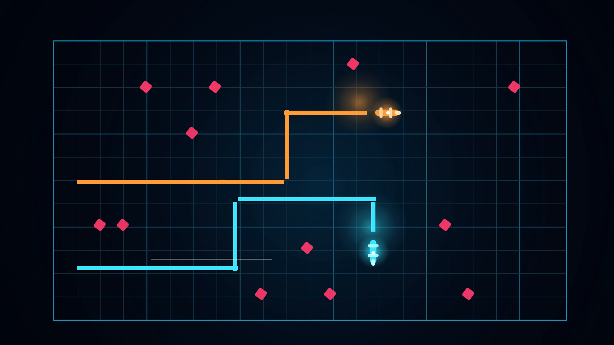
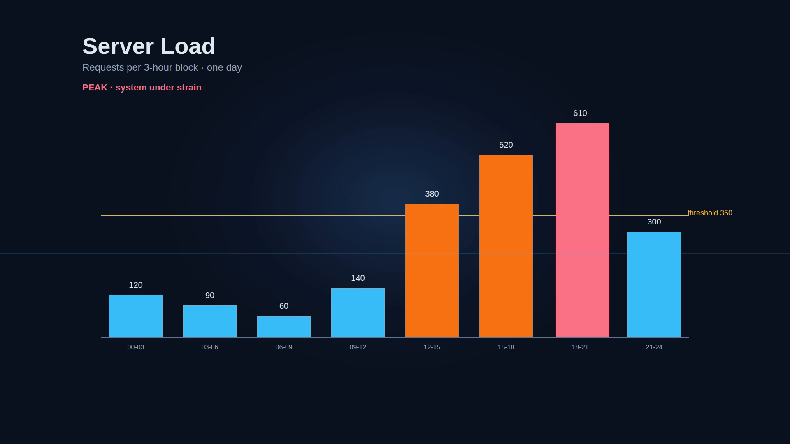
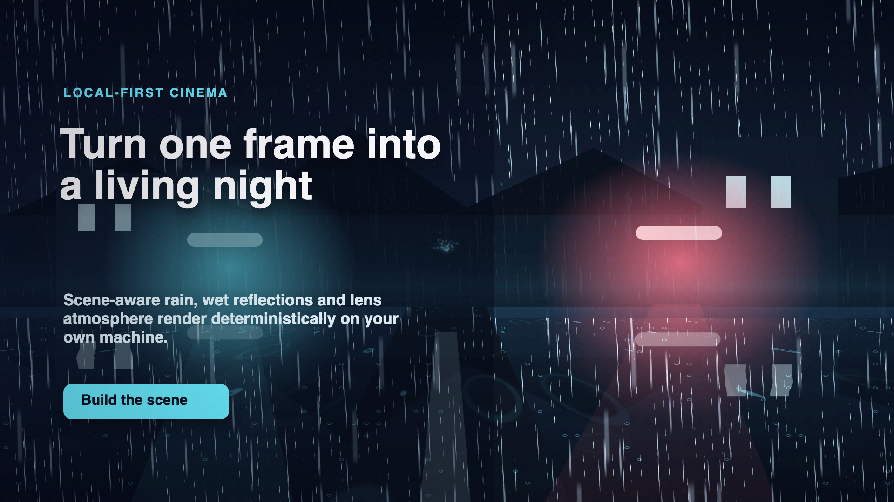
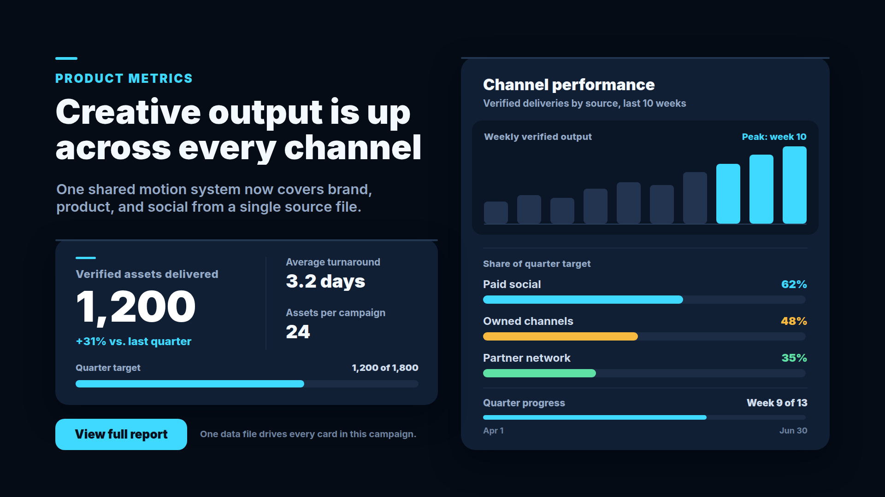

# ShellX Motion

**Local, data-driven motion graphics and video rendering for agents, applications, and people.**

ShellX Motion turns declarative compositions and bounded media imports into finished video, still
images, and reusable project packages. It renders locally, exposes typed control through MCP,
Debug API, CLI, and SDK surfaces, and records receipts that identify the inputs, renderer, output,
and quality result.

Use Motion to:

- build animations from layers, keyframes, procedural relationships, checkpoints, and data recipes;
- render MP4, WebM, GIF, still images, and PNG sequences;
- drive template variants from CSV or JSON;
- import supported subsets of HTML/CSS, Lottie/dotLottie, glTF/GLB, captions, and OTIO;
- combine text, shapes, images, video, audio, masks, mattes, effects, particles, environments, and
  bounded 3D scenes;
- control the same project from an AI agent, the local Workbench, or a host application.

**[Product overview and demos](https://theshellx.com/motion)** ·
**[Online manual](https://docs.theshellx.com/manual/motion/)** ·
**[Quickstart](docs/public/quickstart.md)**

## What Motion produces

A Motion project is a directory-backed package. Its manifest, composition data, assets, data
sources, and receipts remain portable and inspectable instead of being hidden inside an editor
database.

| Input | Output |
|---|---|
| Motion packages with layers, tracks, keyframes, procedural controls, and templates | H.264/HEVC MP4, VP9/AV1 WebM, GIF, stills, and image sequences where the local toolchain supports them |
| CSV or JSON rows bound to a composition | Deterministic per-row packages, renders, and receipts |
| Bounded HTML/CSS, Lottie/dotLottie, glTF/GLB, captions, and OTIO | Motion packages with explicit lowering or lossiness evidence |
| Package-local images, video, audio, fonts, and governed scripted sources | Hash-bound artifacts and receipts |
| Motion packages prepared for another ShellX application | Versioned connector plans, jobs, artifacts, and lifecycle evidence |

FFmpeg owns video encoding and muxing. Motion owns the composition: what appears, when it appears,
how it moves, which rendering lane is valid, and what evidence accompanies the result.

## Watch it move

These films were rendered by Motion from data-driven packages. Select a poster to open the video.

<table>
<tr>
<td width="50%"><a href="docs/public/media/swarm-animals.mp4"></a></td>
<td width="50%"><a href="docs/public/media/light-cycle.mp4"></a></td>
</tr>
<tr>
<td width="50%"><a href="docs/public/media/data-alive.mp4"></a></td>
<td width="50%"><a href="docs/public/media/server-load.mp4"></a></td>
</tr>
</table>

More checked packages and workflows are catalogued in
[Rendering samples for agents](docs/public/RENDERING_SAMPLES.md).

## Core capabilities

### Data-first authoring

Motion packages describe compositions as validated data. Typed commands create and revise packages
through copy-on-write outputs, so an agent can change a value, add a keyframe, bind a relationship,
or render a variant without inventing a private file format. Unsupported fields and unsupported
renderer combinations refuse explicitly.

### Multiple rendering lanes

The browser lane handles the broad production composition surface. A narrow native lane provides
dependency-light still previews for its supported subset. Strict GPU routes cover bounded,
explicitly admitted workloads. FFmpeg converts accepted frame streams into final media and handles
audio and container output.

Lane support is capability-driven rather than assumed. Run `doctor` before authoring for a
particular machine, and consult [Rendering](docs/public/rendering.md) for the current lane matrix.

### Templates and data variants

The public template pack covers titles, kinetic typography, data cards, callouts, promos, and
launch graphics. Controls and media slots are declared data, and batch rendering can bind CSV or
JSON rows to produce deterministic variants. Template quality requirements are documented in the
[Template quality bar](docs/public/TEMPLATE_QUALITY_BAR.md).

<table>
<tr>
<td width="33%"></td>
<td width="33%"></td>
<td width="33%"></td>
</tr>
</table>

### Receipts and reproducibility

Evidence-producing operations return structured receipts. Depending on the operation and the
host-governed destination, a receipt may also be persisted beside the artifact, inside the output
package, or under a dedicated receipt root. Receipts bind source identities, renderer decisions,
output hashes, warnings, and quality results. See
[Receipts and trust](docs/public/receipts-and-trust.md) for the exact persistence rules.

### Agent and application control

Motion exposes one typed command registry through authenticated local transports. Different clients
use intentional subsets of that registry:

| Surface | Role |
|---|---|
| MCP, HTTP, and WebSocket Debug API | Complete typed local automation and discovery |
| CLI | Source-checkout and installed command workflows |
| Local SDK | Typed operations for application integration |
| Action discovery | Search, guidance, and plans for supported workflows |
| Workbench | Human operation over the same package and command contracts |
| Connector protocol | Self-describing job and artifact handoff to compatible hosts |

The generated [Debug command reference](docs/public/DEBUG_API_COMMANDS.md) is the readable command
index. The JSON files under [`schemas/`](schemas/) are the machine contracts.

## Quick start

Motion currently ships as a source release. It requires:

| Dependency | Requirement |
|---|---|
| Node.js | 24 or newer |
| pnpm | 10.6 or newer |
| FFmpeg and FFprobe | Final video, audio, and media quality checks |
| Chrome or Chromium | Browser-lane previews and rendering |

Clone the repository:

```bash
git clone https://github.com/martinsbrezauckis/shellx-motion.git
```

Enter the `shellx-motion` directory, then install and build the workspace:

```bash
pnpm install
pnpm build
```

On POSIX systems, Motion intentionally refuses a source checkout that is group- or world-writable
for local copy-on-write operations. The [Quickstart](docs/public/quickstart.md) explains the safe
checkout setup and the equivalent Windows authority check.

Check the local rendering capabilities and validate a fixture:

```bash
pnpm --filter @shellx-motion/cli run cli -- doctor
pnpm --filter @shellx-motion/cli run cli -- validate fixtures/packages/lower-third
```

Inside this source workspace, invoke the CLI as:

```text
pnpm --filter @shellx-motion/cli run cli -- <command>
```

An installed packed build exposes the same CLI as:

```text
shellx-motion <command>
```

There is no `motion` shell binary. Names such as `motion.render.final` are Debug API and MCP
command identifiers.

### Render a package

```text
pnpm --filter @shellx-motion/cli run cli -- preview fixtures/packages/lower-third \
  --out .scratch/previews

pnpm --filter @shellx-motion/cli run cli -- render fixtures/packages/lower-third \
  --lane ffmpeg --out .scratch/renders/lower-third.mp4

pnpm --filter @shellx-motion/cli run cli -- quality-check \
  .scratch/renders/lower-third.mp4
```

Do not treat a successful command envelope alone as proof of a render. Inspect the returned
artifact and receipt, including its source identity, output hash, warnings, and quality result.

### Start the local Workbench

```text
pnpm start -- \
  --authoring-input-root /absolute/path/to/packages \
  --authoring-output-root /absolute/path/to/revisions \
  --render-package-root /absolute/path/to/packages \
  --render-input-root /absolute/path/to/render-inputs \
  --render-output-root /absolute/path/to/renders
```

The launcher starts Motion on loopback and opens the local Workbench. Authoring and rendering roots
are host policy: requests can use granted locations but cannot widen them. The **Connections** page
provides supported-agent setup and generic MCP connection details.

For the complete first-run sequence, output locations, lane selection, and receipt verification,
follow the [Quickstart](docs/public/quickstart.md).

## Packages, trust, and external tools

Motion is local-first, not a claim that every optional workflow is offline:

- declarative layers such as shapes, text, keyframes, particles, environments, and fixed 3D scenes
  do not execute package-selected code;
- package-local `web`, `html`, and `canvas` sources may execute JavaScript in Chromium and
  must be treated as code;
- the bounded HTML interchange importer strips executable HTML rather than adopting it as a
  scripted source;
- rendering processes and file operations remain constrained by the configured local authorities;
- agent-assisted authoring may send prompts and permitted context to the provider CLI selected by
  the operator, under that provider's terms;
- remote publishing is reserved and is not enabled by ordinary local commands.

Read [Security model](docs/public/security-model.md) before rendering an untrusted package or
enabling a scripted source.

## ShellX integrations

Motion, ShellX Cut, and Design Studio use the same package, job, receipt, and connector concepts.
The connector catalog is self-describing: a host discovers supported request, lifecycle, error, and
artifact classes instead of branching on every Motion feature. Hosts discover availability at
runtime; unsupported editable lowering uses an explicit rendered-media path or refuses.

Integration authors should start with [Host integration](docs/public/host-integration.md) and
[Cut and Design Studio](docs/public/cut-and-design-studio.md).

## Documentation

- [Quickstart](docs/public/quickstart.md) — installation to verified render
- [Implemented features](docs/public/FEATURES.md) — supported capabilities and explicit limits
- [Rendering samples](docs/public/RENDERING_SAMPLES.md) — checked examples and workflows
- [Rendering](docs/public/rendering.md) — lanes, output formats, audio, and quality
- [Debug API](docs/public/DEBUG_API.md) — authentication, transports, and discovery
- [Debug command reference](docs/public/DEBUG_API_COMMANDS.md) — generated command and permission index
- [Receipts and trust](docs/public/receipts-and-trust.md) — evidence and persistence contracts
- [Security model](docs/public/security-model.md) — trust boundaries and untrusted inputs
- [Agent skill](skill/shellx-motion/SKILL.md) — operating contract for AI agents

## Development

```bash
pnpm test
```

This runs the public source-release test contract.

Generated contracts are checked into the repository. When command metadata changes, regenerate the
derived references with the documented project scripts instead of editing generated files by hand.

## License

ShellX Motion is released under the [MIT License](LICENSE), © 2026 Martins Brezauckis.
Third-party notices and redistributed asset licenses are recorded in [NOTICE](NOTICE).
